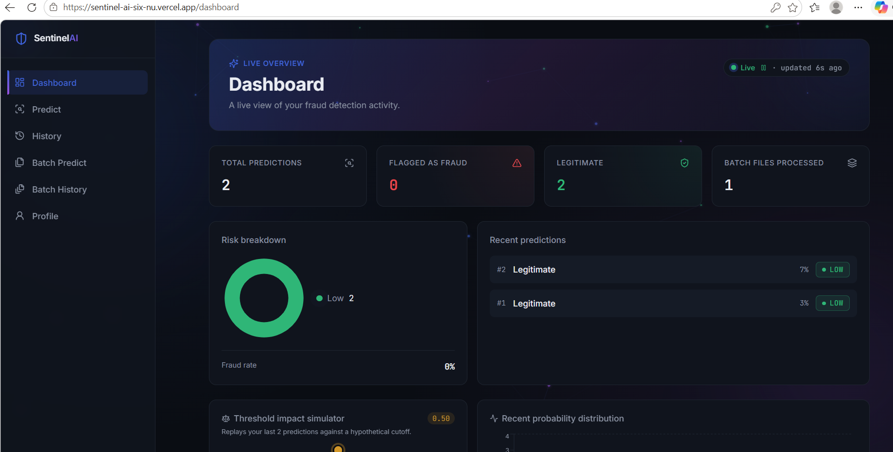
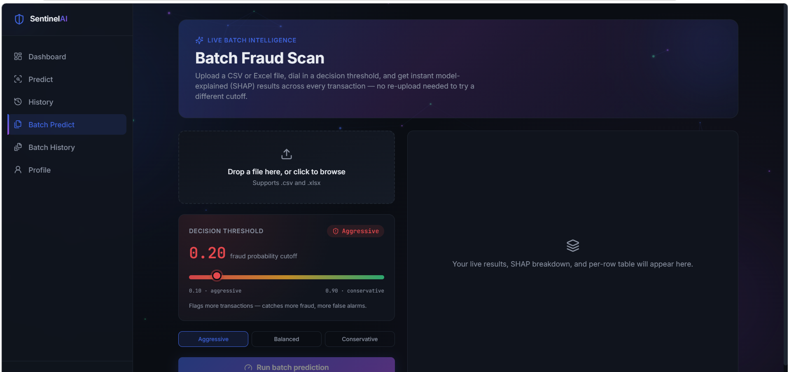
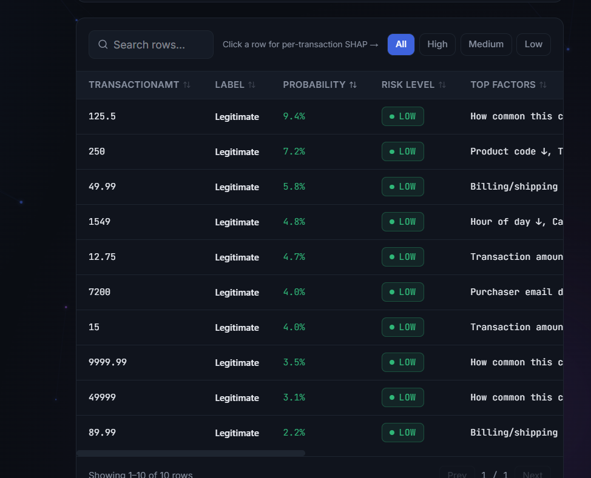
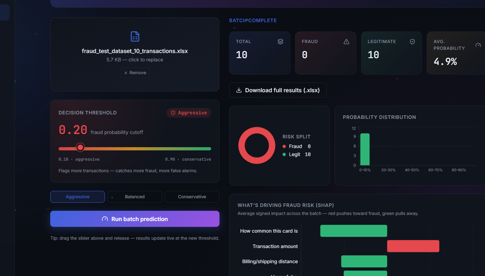

<div align="center">

# 🛡️ SentinelAI
### AI-Powered Fraud Detection Platform

Real-time transaction scoring, batch analysis, and model explainability — built on LightGBM, FastAPI, and React.

[](https://sentinel-ai-six-nu.vercel.app)
[](https://sentinel-ai5.onrender.com/docs)


</div>

---

## What this is

A full-stack fraud detection system that scores credit card transactions in real time, with a decision threshold you can tune live and SHAP-based explainability on every single prediction — not just a black-box score. Built on the IEEE-CIS Fraud Detection dataset (~590K real transactions, 424 engineered features), served through a FastAPI backend, with a React dashboard for single scoring, batch scoring, history, and analytics.

> ### 🔗 [**Try it live → sentinel-ai-six-nu.vercel.app**](https://sentinel-ai-six-nu.vercel.app)
> Register an account, run a prediction, or drop in `test_transactions_1000.xlsx` for a full batch scan with live SHAP explainability. No setup required.

**API docs:** [sentinel-ai5.onrender.com/docs](https://sentinel-ai5.onrender.com/docs)

---

## Why this isn't just another fraud-detection clone

Most portfolio fraud-detection projects stop at "upload a CSV, get a fraud/not-fraud label." This one goes further in ways that actually matter in production ML systems:

| | Typical tutorial project | SentinelAI |
|---|---|---|
| Decision threshold | Hardcoded 0.5 | **Live slider (0.10–0.90)** with Aggressive/Balanced/Conservative presets — see precision/recall trade-offs instantly, no retraining |
| Explainability | None, or a single global feature-importance chart | **Per-transaction SHAP**, row-aware for batch uploads, plus an aggregate "what's driving fraud risk" view |
| Batch results | A downloadable file, nothing else | **Searchable, filterable, sortable live results table** with per-row SHAP inspection |
| Model imbalance | Reported as "95% accuracy" | Explicitly surfaced with **precision/recall**, not just misleading accuracy, because the dataset is ~3.5% fraud |
| Dashboard | Static counts | **Live-updating charts** built from real prediction history — trend, distribution, risk breakdown, threshold simulator |
| Data used to test it | Fake/random rows | A **1,000-row synthetic dataset built from 9 realistic fraud/legit scenarios** (card testing, account takeover, new-customer false-positive checks) with ground truth labels, used to actually benchmark the model |

## Try it in under 60 seconds

1. Open **[sentinel-ai-six-nu.vercel.app](https://sentinel-ai-six-nu.vercel.app)** and register a free account
2. Go to **Predict**, fill in a transaction, and watch the SHAP panel explain the verdict live
3. Drag the **decision threshold** slider and see the risk badge update instantly — no re-submission needed
4. Go to **Batch Predict**, upload any CSV/XLSX of transactions, and get a full searchable, explainable results table in seconds

> Free-tier hosting note: the backend spins down after inactivity, so the very first request after a while may take 30–60 seconds to wake up. Everything after that is instant.

---

## Screenshots

<table>
<tr>
<td width="50%">

**Live Dashboard**
<br>Real-time stats, risk breakdown, threshold impact simulator, and a probability distribution chart — all driven by real prediction history.



</td>
<td width="50%">

**Batch Fraud Scan**
<br>Upload a CSV/XLSX, drag the decision threshold live, and get instant model-explained (SHAP) results across every transaction — no re-upload needed to try a different cutoff.



</td>
</tr>
<tr>
<td width="50%">

**Per-Transaction Results**
<br>Searchable, filterable results table — click any row for its individual SHAP breakdown, filter by risk level, sort by any column.



</td>
<td width="50%">

**What's Driving Fraud Risk**
<br>Aggregate SHAP impact across the whole batch — red pushes toward fraud, green pulls away — so you can see *why* the model flagged what it flagged, not just what it flagged.



</td>
</tr>
</table>

---

## Features

### Machine Learning
- **LightGBM classifier** in a scikit-learn `Pipeline` (preprocessing + model), trained on the IEEE-CIS Fraud Detection dataset
- **Live, adjustable decision threshold** (0.10–0.90) with **Aggressive / Balanced / Conservative** presets — results update instantly without re-running predictions, so you can see the real precision/recall trade-off in real time
- **SHAP explainability on every prediction**, single and batch:
  - Single predictions are explained only using fields the user actually filled in — nothing is inferred from unset defaults
  - Batch predictions are **row-aware**: a feature is only credited as a driver for a row if that row actually supplied a value, since uploads can contain far more real columns than the manual form
  - Batch runs also surface an **aggregate SHAP view** — the biggest drivers across the whole file, not just per-row
- Engineered features: transaction hour, log-scaled amount, and card-familiarity signals (`card1_freq`, `card1_count`, `amt_mean_card`) derived from the training distribution

### Backend (FastAPI)
- JWT authentication (register / login / logout)
- Single transaction prediction with SHAP explainability and configurable threshold
- Batch prediction from CSV/XLSX upload, with results downloadable as an annotated `.xlsx` (`Prediction`, `Label`, `Probability`, `Risk Level`, `Top Factors` columns)
- Full prediction history (single + batch), with per-item and bulk delete
- Dashboard aggregate statistics endpoint
- PostgreSQL persistence (Neon, serverless)

### Frontend (React + Vite + Tailwind)
- Dark "security console" identity — deep slate background, indigo accent, functional green/amber/red risk colors
- Animated live background (drifting aurora blobs, scanning sweep, floating particles) with count-up stats and fade-in transitions throughout
- **Dashboard** — live stats, risk breakdown, 14-day trend, probability distribution, threshold impact simulator, recent predictions feed, manual refresh with live timestamp
- **Predict** — transaction form with a live result panel: verdict, risk badge, probability meter, adjustable threshold, and SHAP "what drove this result" breakdown
- **Batch Predict** — drag-and-drop upload, live threshold slider with preset modes, searchable/filterable per-row results table, aggregate SHAP chart, downloadable annotated results
- **History / Batch History** — full record tables with delete and re-download
- **Profile** — view/edit account details

---

## Tech Stack

| Layer | Technology |
|---|---|
| ML | LightGBM, scikit-learn, SHAP, pandas, NumPy |
| Backend | FastAPI, SQLAlchemy, PostgreSQL (Neon), JWT (python-jose), Passlib |
| Frontend | React 19, Vite, Tailwind CSS v4, Recharts, React Router, Axios |
| Hosting | Vercel (frontend), Render (backend) |

---

## Project Structure

```
AI-Fraud-Detection-APP/
├── app/
│   ├── main.py                # FastAPI entrypoint + CORS
│   ├── database.py            # SQLAlchemy engine/session (Neon, SSL)
│   ├── model.py                # ORM models (User, PredictionHistory, BatchHistory)
│   ├── schemas.py              # Pydantic request/response schemas
│   ├── oauth2.py                # JWT auth logic
│   ├── config.py                # Environment-based settings
│   ├── ML/
│   │   ├── predictor.py         # Feature prep, prediction, SHAP explainability
│   │   ├── fraud_model.pkl      # Trained pipeline (preprocessor + LightGBM)
│   │   ├── card1_stats.pkl      # Precomputed card-familiarity lookups
│   │   └── features.pkl         # Ordered list of the 424 model features
│   └── routers/
│       ├── auth.py
│       ├── predict.py
│       ├── history.py
│       ├── batch_history.py
│       ├── dashboard.py
│       └── profile.py
├── frontend/
│   └── src/
│       ├── pages/                # Dashboard, Predict, History, Batch, Profile, Auth
│       ├── components/           # RiskBadge, ProbabilityMeter, TopFactors, LiveBackground
│       ├── layouts/               # MainLayout (sidebar shell)
│       └── services/               # Axios API clients
└── requirement.txt
```

---

## Running Locally

### Backend

```bash
python -m venv venv
venv\Scripts\activate        # Windows
# source venv/bin/activate   # macOS/Linux

pip install -r requirement.txt
```

Create a `.env` file in the project root:

```dotenv
database_username=your_neon_username
database_password=your_neon_password
database_hostname=your-neon-pooler-hostname.aws.neon.tech
database_port=5432
database_name=your_db_name
secret_key=some_long_random_string
algorithm=HS256
access_token_expire_minutes=30
```

```bash
uvicorn app.main:app --reload
```

API docs at `http://127.0.0.1:8000/docs`.

### Frontend

```bash
cd frontend
npm install
npm run dev
```

App at `http://localhost:5173`. Set `VITE_API_URL` in `frontend/.env` to point at your local or deployed backend.

---

## API Overview

| Method | Endpoint | Description |
|---|---|---|
| POST | `/auth/register` | Create an account |
| POST | `/auth/login` | Get a JWT access token |
| POST | `/predict/` | Score a single transaction, with optional `threshold` and SHAP breakdown |
| POST | `/predict/batch` | Score a CSV/XLSX of transactions, with optional `threshold` and aggregate SHAP |
| GET | `/predict/download/{filename}` | Download a batch result file |
| GET / DELETE | `/history/` | List / clear single-prediction history |
| GET / DELETE | `/batch-history/` | List / clear batch run history |
| GET | `/dashboard/`, `/dashboard/statistics`, `/dashboard/recent-predictions` | Aggregate stats for the dashboard |
| GET / PUT | `/profile/` | View / update account details |

---

## Model Notes & Honest Limitations

- Several fields (`card1–card6`, `dist1`) are **anonymized identifiers** from the source dataset, not real-world values — there's no meaningful mapping back to actual banks or distances.
- Card-familiarity features (`card1_freq`, `card1_count`, `amt_mean_card`) are computed from the **original training data**, not from patterns within an uploaded batch.
- Categorical fields are matched against a **fixed vocabulary learned at training time** — any unseen value is encoded as "no signal" rather than raising an error.
- The dataset is highly imbalanced (~3.5% real fraud rate), so accuracy alone is a misleading metric — this is why the decision threshold is adjustable rather than fixed, and why the dashboard surfaces precision/recall trade-offs directly.
- SHAP explainability reflects what the model *learned*, not a causal explanation of why a transaction is actually fraudulent.

---

## License

For personal/portfolio use. The IEEE-CIS Fraud Detection dataset is provided by Vesta Corporation via Kaggle and is subject to its own competition rules/license.
